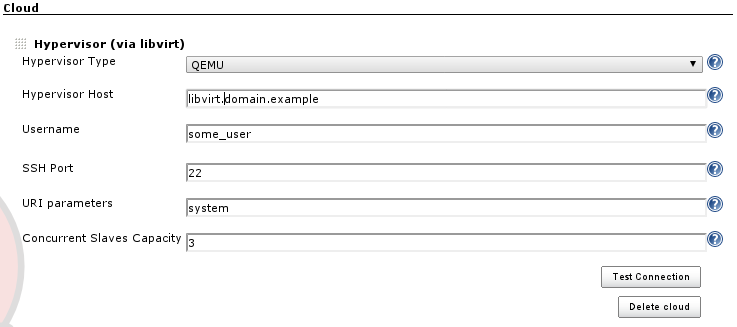
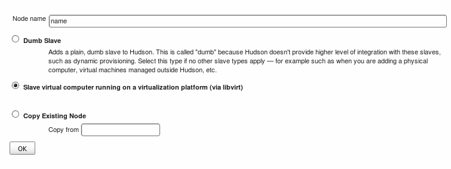
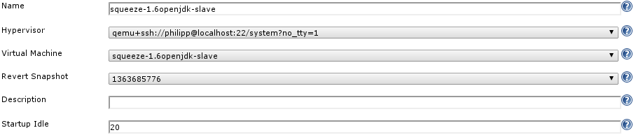

Add Libvirt Hypervisor slave support to Jenkins

libvirt-slaves 1.8 uses a newer libvirt java binding.
If you are upgrading from an earlier version of this plugin,
you will have to reconfigure your hypervisor settings
and thus also all libvirt-controlled nodes!

The least painful approach (especially for larger setups)
is to properly set up the Hypervisor first,
followed by editing each node, pointing it to the reconfigured Hypervisor.
It is not necessary to delete node configurations!

### Description

This plugin for Jenkins CI adds a way to control guest domains hosted on Xen or QEMU/KVM.
You configure a Jenkins Slave, selecting the guest domain and hypervisor.
When you need to build a job on a specific Slave,
its guest domain is started, then the job is run.
When the build process is finished, the guest domain is shut down,
ready to be used again as required.

### Requirements

For a communication with Hypervisors you need to install **libvirt** library on Jenkins machine.
This plugin comes with libvirt java binding,
but is just an interface to the "real" C libvirt library.
In your distribution you should have a package to install libvirt
(ie *yum install libvirt* on RedHat/Fedora/Centos distributions).

### Configuration

##### Hypervisor

The first step is the Hypervisor configuration.
To create a new Hypervisor you need to add a new "Cloud" in the Jenkins "Manage Jenkins" menu.

 

The required parameters to setup are:

-   **Hypervisor Type**: QEMU / XEN to respect the Hypervisor you have in your system
-   **Hypervisor Host**: Hostname or IP address to contact your hypervisor
-   **Username**: username to use for connection.
-   **Port**: ssh port, if in your hypervisor machine is different than 22
-   **URI parameter**: by default xen and kvm expose the control API using *system*.
    If, for any reasons, you don't have this default value or need to provide further parameters,
    you can set those here
-   **Concurrent Slaves Capacity**: If you are running a setup where slaves are being shut down once they are idling
    and you want to control how many concurrent slave can be run by Jenkins on the particular hypervisor,
    you can set this threshold here.
    Providing 0, the default value, disables the threshold.
    Please note that a threshold will not fail build jobs,
    Jenkins will simply reissue the slave commissioning once the hypervisor is again running below its threshold,
    thus delaying the start up of slaves

The connection to Hypervisor will be done using ssh, so you don't need to setup libvirt,
exposing your services on tcp that could be a security hole in your infrastructure.
Here an example of connection string will be used by Libvirt Slaves Plugin to create a connection with the hypervisor:

     xen+ssh://username@hostname:port/system

you can test you connection typing, from your Jenkins Server:

     virsh connect xen+ssh://username@hostname:port/system

An important thing is the RSA public key exchange between Jenkins Server and Hypervisor Machine:
you need to add to .ssh/known\_hosts file the rsa.pub file of your jenkins user.
This because, for an actual limitation in libvirt java library,
it's impossible to provide via code the ssh password,
that means Jenkins could not establish a connection if password request will be prompted.

To verify all you parameters you can click on *Test Connection* button and check the output reported.

##### Slaves

Now you can setup your nodes in Jenkins and use them to build your projects.

Once the node is created, you'll see the configuration page as shown below:

Here you can configure the following details:

-   **Hypervisor**: here you select one of the clouds that you
    configuration at the central Configure Jenkins page
-   **Virtual Machine**: select one of the virtual machines that you want to use as a slave
-   **Revert Snapshot**: optionally you can select an existing snapshot of the virtual machine
    that you want the slave to be reverted to once it is being shut down
-   **Startup Idle**: this optional value (default is 60) allows you to specify an idle timer in seconds.
    Once the virtual machine has been started,
    Jenkins will wait that long before starting the actual slave service on the virtual host.
    If your hypervisor is super quick, set a low value,
    if it takes a while to get that VM up, increase the timer.
